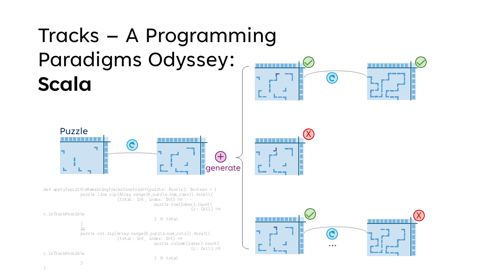
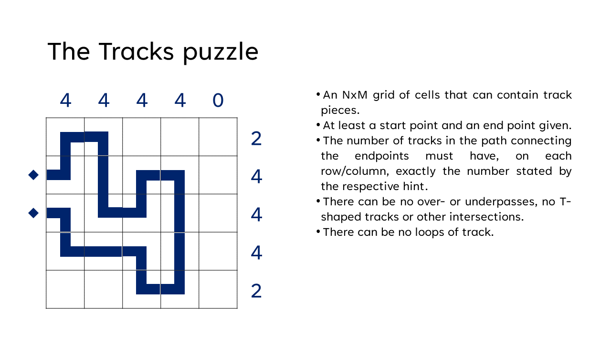
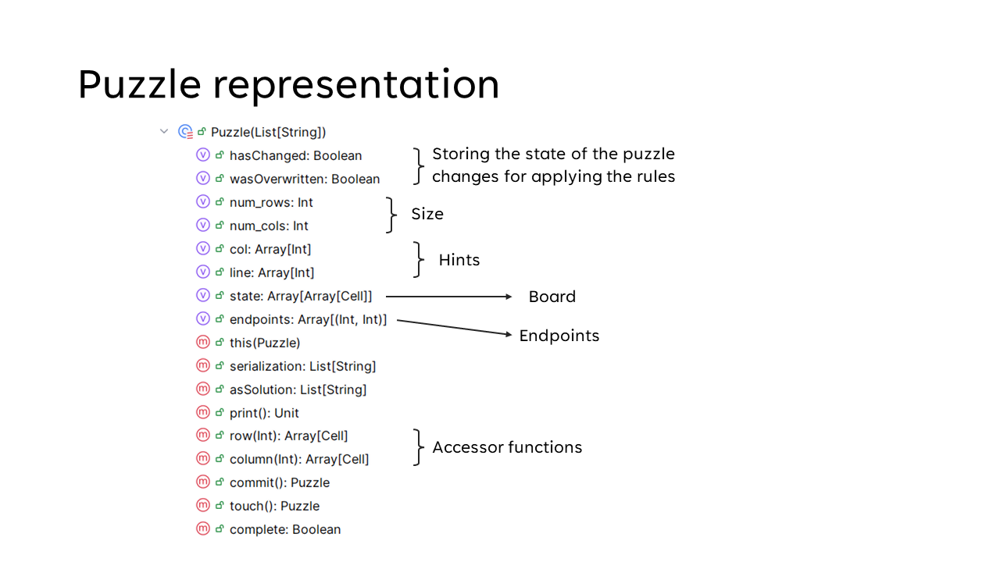
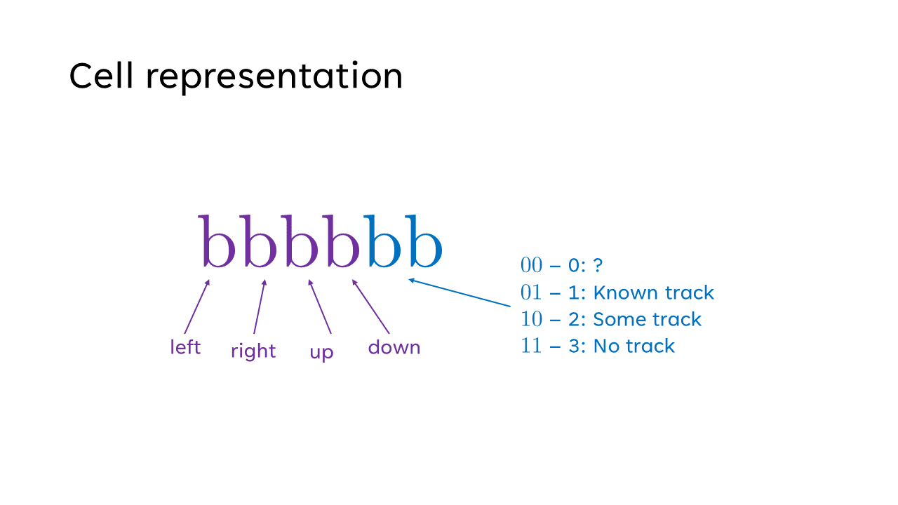
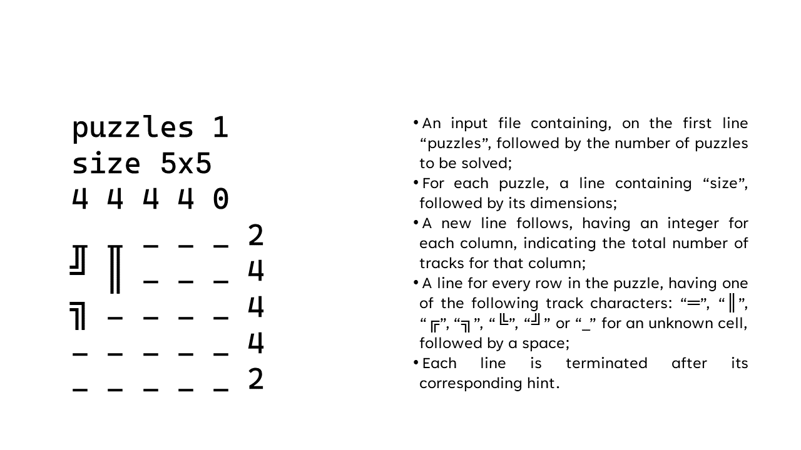
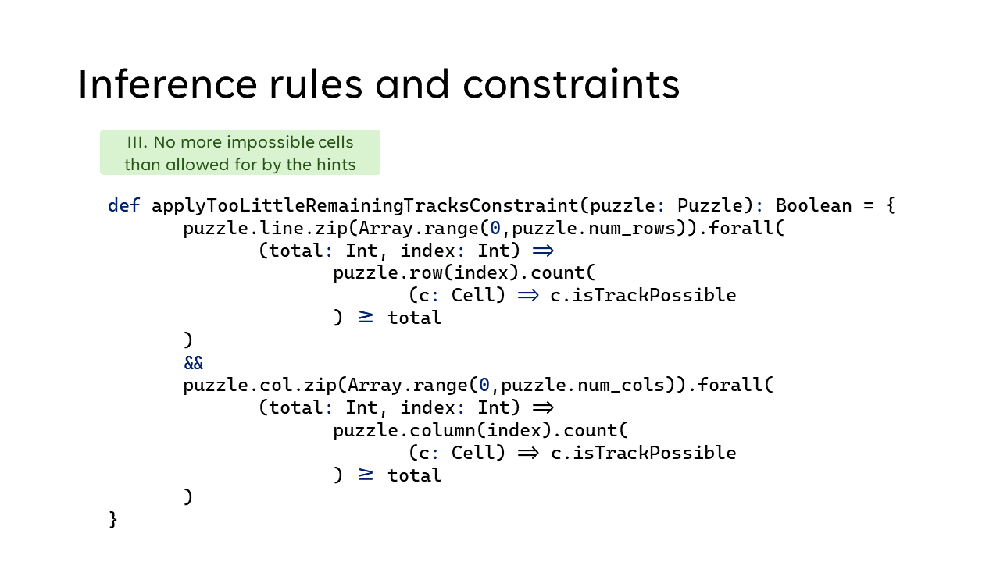
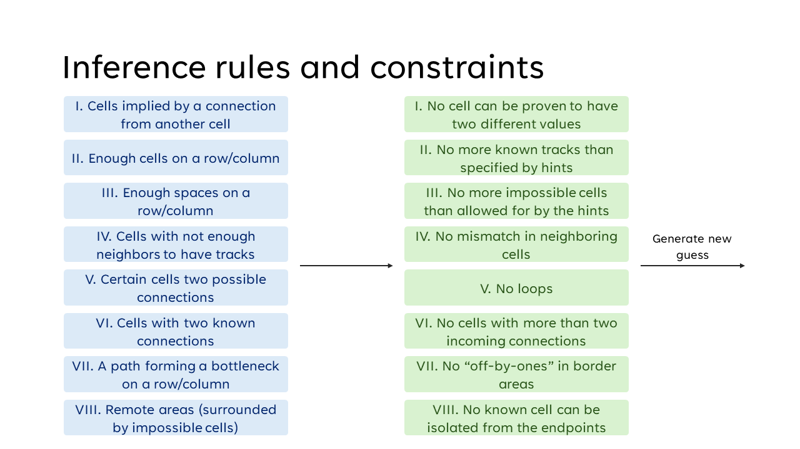

# Tracks Puzzle Solver in Scala

> This is a part of a series of track solvers implemented in different programming languages for a University semester project on programming paradigms and search strategies.
> See its [Prolog counterpart here](https://github.com/vladoleksik/tracks-prolog).

## Overview
The project implements a solver for the Tracks puzzle using Scala. The puzzle consists of a rectangular grid with numerical hints for each row and column, and the goal is to construct a continuous, non-branching rail track connecting predefined endpoints. The solver ingests puzzles from ASCII-formatted files, processes them using a logic-driven approach, and outputs completed solutions in the same format.

The core challenge is the puzzle’s large search space. Scala's functional model and pattern-matching abilities make it suitable for expressing inference rules and constraints, but, with large constants and a very expansive search space, performance is still mostly dependent on the solver's ability to prune states as early as possible.

## Tracks Puzzle Description

The Tracks puzzle is played on a rectangular grid. Each row and column has a numeric hint indicating how many cells in that line must contain a track segment. The objective is to build a single continuous, non-branching track that connects the puzzle's designated endpoints while satisfying all row and column counts.

- **Grid and hints**: Each row and column provides a number equal to the count of cells in that line that must contain part of the track.
- **Track shape**: Track segments occupy whole cells and join through cell edges. Segments can be straight or corner pieces.
- **Connectivity**: The finished track must be a single continuous path connecting the designated endpoints (no disconnected loops or multiple components).
- **No branching**: Except for the two endpoints (which have one connecting neighbor), every track cell has exactly two track neighbors.
- **Pre-filled / blocked cells**: Some puzzles may include cells that are pre-marked as track; the solver respects these constraints.

This README documents the solver's representation and solving strategy; see the References section for pointers to puzzle collections and Scala resources.

## References
- [Tracks Puzzle docs by Simon Tatham](https://www.chiark.greenend.org.uk/~sgtatham/puzzles/js/tracks.html)
- [Scala Documentation](https://docs.scala-lang.org/)

## Puzzle Representation

The solver models each puzzle as a structured Scala class:

It includes:
- **Size**: Width and height of the grid.
- **Row and Column Hints**: Lists of integers representing the required track counts.
- **Cells**: The board, as a bidimensional array of cell states, each modeled as Scala `Cell` class objects.
- **Endpoints**: Coordinates of the two track endpoints.
- **Flags**: Metadata such as whether the puzzle has changed since the last inference pass or contradictions.

A `Cell` is represented by a state and coordinates.
Cell states encode `(left, right, up, down)` on bits 5-2, while the two least significant bits encode knowledge state:
- Unknown (`00`)
- Certain: 
  * straight segments, corners (`01`)
  * or generic “must contain track” (`10`)
- Impossible/empty (`11`)

This representation supports partial knowledge, while contradictory states still do have to be handled by higher-level logic.

## File Workflow
1. Read number of puzzles.  
2. For each puzzle:
   - Read size, column hints, row hints, and cell states.
   - Convert Unicode input to internal atoms.
   - Handle edge cases such as trailing spaces.
3. After solving, write the output puzzle with identical formatting.

## Core Components

### Counters
Used to evaluate whether a row or column satisfies its numeric hint. They collect relevant cells and count those that meet specific conditions. Efficiency is maintained by avoiding unnecessary variable bindings.

### Getters & Setters
These functions access and modify cell states in the board array, without having to expose the bit encodings and flags. They handle coordinate translation and ensure that changes to cells update the puzzle's "changed" flag.

### Solving Strategy
The solver applies a set of inference rules that examine each cell and its neighbors. Rules deduce whether cells must be filled, must be empty, or must take a specific track shape. Examples include:
- Fill a cell if a track segment must continue.
- Mark a cell empty if too few neighbors are possible.
- Apply row/column-level rules once their track count is fully determined.

When inference can no longer deduce new information, the solver makes a controlled guess — choosing a possible state for an uncertain cell.

Guessing can use two strategies:
- **Least possible options**: Has potential to use heuristics to minimize branching. Still, definition of *possible* is tricky — in the end, there is always only one "possible" state — the correct one.
- **Continuous path**: Chooses cells that are adjacent to already known track segments, to maintain connectivity.

Our solver uses the second strategy, as it allows for more aggressive pruning through connectivity constraints.

For transparency, guessing for a cell takes place in this order:
1. `║`
2. `╔`
3. `╚`
4. `╗`
5. `╝`
6. `═`

### Validation
Before proceeding, the solver rejects boards whose row/column hints are already violated or that have other implied contradictions.

The validation rules enforcing is entirely declarative, as rules are applied as declared, through a common interface, without side effects, and return a boolean that can be used in higher-level logic.

## Correctness and Results
The solver was tested on 101 teacher-provided puzzles:
- **94 solved** within a 1-minute execution target.
- **4.048 seconds** median runtime for a puzzle.
- **45x45** largest solved puzzle.

## Architectural Notes
The solver is structured modularly:
- Clean separation of inference rules, constraints, I/O, and validation.
- Minimal side effects; as desired in a functional language, immutability is used throughout the solver.
- New inference rules can be added without major restructuring.

## Reflection
The project demonstrates Scala's strengths in expressing complex logic through pattern matching and functional constructs. Better performance was achieved by careful ruleset design and using an expansive ruleset for early pruning of impossible states.

Future improvements include:
- Improving representation efficiency using case classes.
- Using pattern matching for cleaner rule definitions.

## Appendix (Summary)

### Example Inference Rules
- **AdjacencyRule**: Uncertain cells adjacent to known tracks become filled.  
- **OnlyTwoGoodNeighboursRule**: A filled cell with two valid neighbors must connect to them.  
- **NoTracksRemainingRule** / **OnlyTracksRemainingRule**: Row/column pruning based on remaining capacity.

Additional, more complex rules were used than in the case of the [Prolog solver](https://github.com/vladoleksik/tracks-prolog), achieving significant, scalable performance improvements on larger puzzles:
- **RemoteAreaRule**: Isolated areas without endpoints cannot contain tracks.

### Example Constraints
- **NoLoopsConstraint**: Completed track must be non-looping.  
- **MoreTracksThanPossibleConstraint**: Rejects any axis exceeding its hint.  
- **No contradictions**: Multiple conflicting deductions invalidate a branch.

As for the inference rules, the constraints were expanded and refined to improve pruning effectiveness:
- **NoThreesomesConstraint**: No cell may connect to three or more track segments.
- **OffByOneConstraint**: No border row/column may be off by one from its hint with no other known cells. (For parity reasons, this will be impossible to later complete.)
- **NonIsolationConstraint**: No track cell may be completely isolated from the rest of the track.